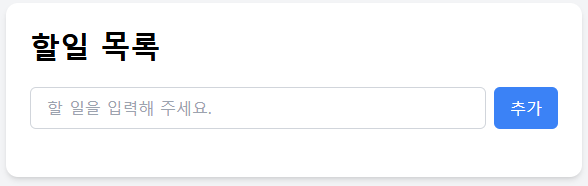
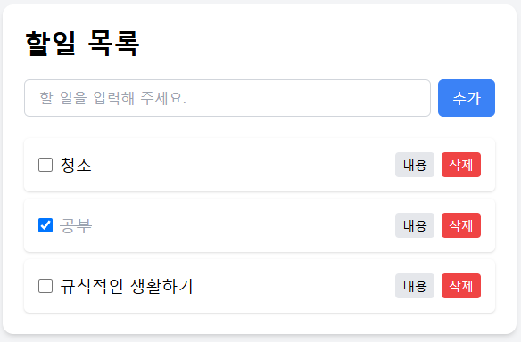
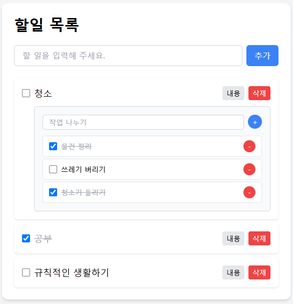

# 📌 Todo List with Detail

React와 Tailwind CSS를 사용한 할 일 관리 앱입니다.  
할 일뿐만 아니라 각 할 일의 **세부 항목까지 함께 관리**할 수 있도록 구성되어 있습니다.

---

<br>

## ✨ 주요 기능

-   ✅ **할 일 추가/삭제/체크**

    -   텍스트 입력 후 `추가` 버튼으로 할 일 생성
    -   완료 여부 체크박스로 상태 전환
    -   `삭제` 버튼으로 항목 삭제

-   🔍 **세부 사항 관리**

    -   각 할 일마다 `내용` 버튼으로 세부 항목 영역 열기/닫기
    -   세부 항목도 추가/삭제/완료 체크 가능

-   💾 **로컬스토리지 연동**
    -   새로고침해도 할 일 및 세부 항목이 유지됨
    -   `localStorage`에 자동 저장 및 불러오기 기능 포함

<br>

---

## 🖼️ 스크린샷

> 아래는 프로젝트 실행 예시 화면입니다.

### 📌 초기 화면



### 📌 할 일 추가 화면



### 📌 세부사항 입력/관리 화면



<br>

## 📁 프로젝트 구조

```
react-todo-mission1/
├── public/
├── src/
│ ├── components/
│ │ ├── main/                   # 메인 Todo 기능 관련 컴포넌트
│ │ │ ├── TodoHead.jsx
│ │ │ ├── TodoInput.jsx
│ │ │ ├── TodoList.jsx
│ │ │ └── TodoItem.jsx
│ │ └── details/                # 세부 항목(Detail) 관련 컴포넌트
│ │ ├── TodoDetail.jsx
│ │ ├── DetailInput.jsx
│ │ ├── DetailList.jsx
│ │ └── DetailItem.jsx
│ ├── context/
│ │ └── TodoContext.jsx         # 전역 상태 관리
│ ├── hooks/
│ │ └── useTodos.js             # Context 값을 받아 쓰는 커스텀 훅
│ ├── utils/
│ │ ├── storage.js              # localStorage 연동
│ │ └── detailUtils.js          # 세부 항목 관련 순수 함수들 (추가/삭제/토글)
│ ├── App.jsx
│ ├── main.jsx
│ └── index.css
└── index.html
```
---

## 🛠️ 기술 스택

-   React
-   Tailwind CSS
